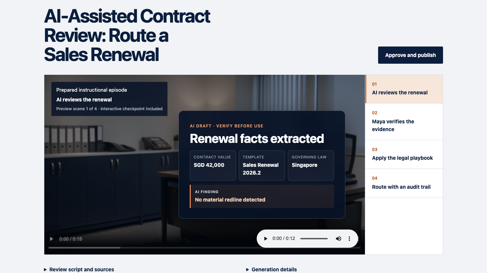

# LAWFLO

**Team 42 · SMU LIT Legal-Tech Hackathon 2026**

[Try the live prototype](https://lawflo.onrender.com/) · [Read the three-minute demo route](docs/JUDGE-DEMO.md)



LAWFLO turns a law firm's approved legal AI workflows into short interactive episodes, realistic guided rehearsals and source-linked guidance lawyers can use at work.

The prototype teaches one concrete workflow: reviewing a low-value sales renewal with legal AI. The AI extracts the routine facts but misses an unlimited-liability clause. The learner must inspect the source, apply the firm's playbook and route the matter to legal review with the evidence attached.

## Product journey

1. A legal AI pioneer supplies the approved workflow, playbook, template, synthetic example matter and a consented or fictional presenter portrait.
2. LAWFLO prepares a source-linked script, storyboard, generated episode and interactive checkpoint for human approval.
3. A learner watches the four-chapter episode and repairs an unsafe reliance decision.
4. The learner repeats the workflow inside a realistic contract-review replica.
5. LAWFLO returns constructive feedback and an audit trail based only on actions the prototype observed.

## What is real in this prototype

- Four locally stored Runway-generated video chapters with generated narration
- Deterministic overlays for exact contract facts, clauses and playbook rules
- A complete creator-to-learner workflow with human approval and publication
- A reducer-driven contract-review rehearsal with unsafe-path recovery
- Versioned source provenance, approval fingerprints and an idempotent event ledger
- Protected server endpoints for OpenAI module generation, OpenAI speech and Runway video generation
- Persistent browser progress and a full demo reset

The public presentation uses reviewed, downloaded media instead of waiting for a live generation queue. The prepared source pack is compiled locally into the approved scenario; the protected generation endpoints demonstrate the production integration boundary and require server-side credentials.

## Architecture

```text
approved sources
      │
      ▼
validated source bundle ──► typed script/storyboard ──► human approval
      │                                                   │
      ├──► generated episode + checkpoint                 │
      ├──► guided legal-AI rehearsal                      │
      └──► source lineage + event ledger ◄────────────────┘
```

The frontend is React, TypeScript and Vite. The Render service uses a small Node HTTP adapter to serve the built application and the protected generation routes. Domain rules, compilation, approval, rehearsal state, coaching and evidence lineage are separated from React views and tested independently.

## Run locally

Requirements: Node.js 22 or later.

```bash
npm ci
npm run dev
```

Open the local URL printed by Vite. Select **Enter LAWFLO**, choose **Legal engineer**, then use the prepared source pack for the reliable demo path.

## Verification

```bash
npm test
npm run build
npm run test:e2e
```

The browser suite covers the complete creator-to-review journey, the compact desktop layout and the intentional handoff from phone to desktop for the rehearsal.

## Optional generation services

The prepared learner experience needs no credentials. Live generation endpoints use these server-only environment variables:

```text
OPENAI_API_KEY
RUNWAYML_API_SECRET
LAWFLO_STUDIO_TOKEN
OPENAI_TEXT_MODEL   # optional; defaults to gpt-4o-mini
```

Never expose these values through Vite variables or commit them to the repository. To regenerate the reviewed demo media locally, set `RUNWAYML_API_SECRET` in your shell and run:

```bash
npm run generate:demo-media
```

Existing completed media files are skipped.

## Responsible-use boundary

LAWFLO is a synthetic training prototype, not legal advice and not an R&T system. It uses fictional people, policies and matters. Generated content remains a draft until a human verifies its source evidence; a material exception overrides the low-value routing shortcut; and the event ledger never presents simulated downstream adoption as observed fact.

## Team

- John Puang
- Su-Ann
- Ananya
- Krishiv

See [CONTRIBUTING.md](CONTRIBUTING.md) for repository conventions and [docs/TECHNICAL-DEPTH.md](docs/TECHNICAL-DEPTH.md) for the implementation map.
